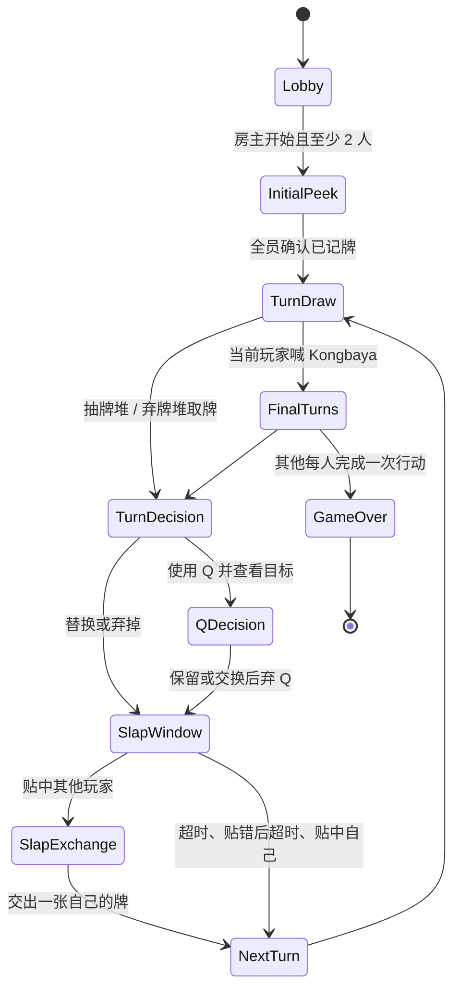
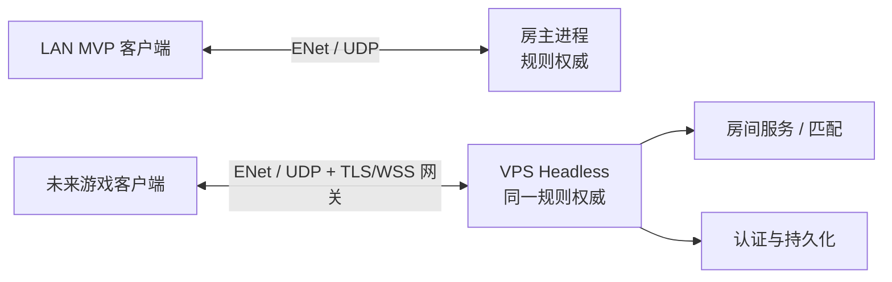

# KONG 开发文档

版本：0.2（MVP 实施规格）  
目标平台：Godot 4.6、Windows / macOS / Linux  
联机阶段：局域网房主制 → VPS 专用服务器

## 文档使用方式与状态

本文是 KONG MVP 的**产品、规则和架构主规格**。后续实现、测试和 Agent 交接必须以本文为准；规则未在本文中写明时，不得自行推断后实现。

配套文档：

- [网络协议 V1](网络协议_V1.md)：字段级客户端/服务器契约与拒绝语义；
- [验收与测试计划](验收与测试计划.md)：测试记录模板、通过门槛和发布闸门；
- [遗物设计卡模板](遗物设计卡模板.md)：Roguelike 内容的准入格式；
- [AI Agent 交接说明](AI_AGENT_交接说明.md)：当前文件职责、不可重构边界和接手顺序。

**实现状态说明：**本文定义的是应遵守的 V1 规格；现有原型已完成规则权威与 LAN 骨架，但尚未完成双实例运行验证，也尚未实现协议版本字段、命令拒绝码和完整测试记录。这些是验证/补齐任务，不是重写状态机的理由。

## 1. 产品定义

KONG 是一款以 **Cambio 的记忆、信息推理与低分博弈** 为核心，并用轻度 Roguelike 为多局体验增加变化的多人卡牌游戏。

一局中，玩家的牌一直背面朝上。玩家只能记住自己曾经看到过的牌，并利用抽牌、换牌、特殊牌、贴牌抢答，将自己的总分和牌数压低。有人在自己的回合开始时喊出 “Kongbaya!” 后，其他人各有一次最后行动机会，然后统一翻牌结算。

本项目的首要体验不是数值构筑，而是：

1. 记忆不完全信息；
2. 在低风险换牌和高价值技能之间取舍；
3. 所有人都能介入的短促贴牌抢答；
4. 从局面判断何时喊 Kongbaya。

Roguelike 内容应当增强这些决策，而不应遮蔽基础牌局。

## 2. MVP 边界

### 本期必须完成

| 模块 | MVP 定义 |
| --- | --- |
| 房间 | 2–4 人，同一局域网，房主创建、他人通过 IPv4 加入 |
| 同步 | 房主权威裁定；客户端只提交操作意图 |
| 牌局 | 54 张牌、完整回合、特殊牌、贴牌、Kongbaya、结算 |
| 隐私 | 暗牌不在常规网络状态里发送真实牌面；查看牌只定向展示一次 |
| 交互 | 点击抽/弃牌堆、手牌、目标牌即可完成一局 |
| 可观察性 | 当前阶段、轮到谁、弃牌顶、行动记录、结算排名 |

### 明确不在 MVP 内

- 匹配、账号、好友、观战、断线重连；
- AI、单人模式、手机端适配；
- 商业化、存档、成就、排行榜；
- Roguelike 遗物、地图、局外成长的实际内容；
- 公网房间、NAT 穿透、反作弊服务；
- 动画、音效、美术主题与本地化完善。

这些项目不应阻塞核心牌局验证。

## 3. 规则裁定规格

### 3.1 卡牌与分值

使用 54 张牌：四花色 A–K，以及红/黑 Joker。花色目前只用于视觉区分；比对与能力均按点数。

| 牌 | 分值 | 能力 |
| --- | ---: | --- |
| A | 1 | 无 |
| 2–6 | 面值 | 无 |
| 7 / 8 | 7 / 8 | 查看自己任意一张牌 |
| 9 / 10 | 9 / 10 | 查看其他玩家任意一张牌 |
| J | 10 | 盲换：交换自己与目标玩家各一张未知牌 |
| Q | 10 | 查看目标牌后，可选择是否用自己一张牌交换 |
| K | -1 | 无 |
| Joker | 0 | 无 |

### 3.2 开局与信息

- 每位玩家获得 4 张背面朝上的牌。
- 仅能在开局查看自己固定的下方两张；界面展示后立即重新盖住。
- 7/8、9/10、Q 产生的查看信息同样是一次性信息，后续不允许从界面重看。
- 玩家应通过记忆和牌的位置管理信息；系统不替玩家记牌。
- 结算前，只有弃牌堆顶和明确公开的信息可被所有人看到。

### 3.3 回合状态机

常规回合严格遵循以下顺序：

1. 当前玩家从抽牌堆或弃牌堆顶取一张牌；
2. 若来自弃牌堆，只能替换自己的一张牌；
3. 若来自抽牌堆，可替换、弃掉，或对 7–Q 发动对应能力；
4. 每当一张牌进入弃牌堆，进入贴牌窗口；
5. 贴牌结束后，才切换至下一位玩家或最终行动的下一位玩家。

### 3.4 技能裁定

- 7/8：操作者指定自己的一个位置，定向看到对应牌面一次。
- 9/10：操作者指定其他玩家的一个位置，定向看到对应牌面一次。
- J：操作者选择一名其他玩家、自己的一个位置、对方一个位置；服务器直接交换两张牌，过程中不显示牌面。
- Q：操作者选择其他玩家一张牌并查看；之后可不换，或选自己一张牌与之交换。
- 从弃牌堆拿到的 7–Q 不可发动其能力。
- 无能力牌、K、Joker 可以替换，也可以从抽牌堆直接弃掉。

### 3.5 贴牌窗口

当新牌进入弃牌堆，服务器开启一个短暂的贴牌窗口（当前设计为 2.5 秒）。所有玩家可点击任意一张暗牌进行尝试。

| 情况 | 服务器行为 |
| --- | --- |
| 点数不匹配 | 该玩家本窗口不能再尝试；从抽牌堆抽 1 张并直接加入手牌；窗口继续 |
| 第一个点数匹配，且目标是自己 | 目标牌进入弃牌堆；该玩家手牌数 -1；窗口结束 |
| 第一个点数匹配，且目标是他人 | 暂停窗口；贴牌者选自己一张牌交给目标玩家；被贴中的目标牌进入弃牌堆；窗口结束 |
| 正确但服务器已收到更早的正确请求 | 不处罚；该请求被忽略 |
| 无人正确 | 超时，进入下一回合 |

“第一个”以权威服务器接收并验证请求的顺序判断，不使用客户端本地时间。这样 LAN 和未来 VPS 都有一致结果。

### 3.6 Kongbaya 与结算

- 仅当前玩家在自己行动开始（`TurnDraw`）可喊 Kongbaya。
- 喊出者不再进行普通行动；按顺时针顺序，其他每位玩家各执行一轮完整最终行动。
- 最终行动仍可触发特殊牌和贴牌。
- 随后翻开所有牌，以以下顺序从低到高排列：总分 → 牌数量 → 从最大单牌开始逐一比较。数值更小者靠前。
- 最低者获胜；最高者扣 1 点生命；中间玩家不扣。
- 若喊话者在其首次行动前就喊 Kongbaya，且最终并非最低者，则只由喊话者扣血。

### 3.7 MVP 最终规则决定

原始规则中“贴别人的牌”一段对于贴牌者是否再得到对方的另一张牌存在矛盾。MVP 采用操作描述最明确、且符合“贴牌减少牌数”目标的版本：

1. 被选中且点数正确的目标牌进入弃牌堆；
2. 贴牌者选择自己一张牌交给目标玩家；
3. 贴牌者因此少一张牌，目标玩家保持牌数不变。

下列规则为 MVP 已冻结决定；实现和测试必须遵循，除非创建新版本的规则变更记录：

| 决策 ID | 最终裁定 | 原因 |
| --- | --- | --- |
| R-01 | 每名玩家在同一个贴牌窗口至多提交一次尝试；贴错后罚抽且不能再次尝试。 | 防止连点和网络刷包，贴牌仍保留风险。 |
| R-02 | 抽牌堆为空时，保留弃牌顶，重洗其余弃牌作为抽牌堆。 | 保持常见纸牌循环且弃牌顶信息稳定。 |
| R-03 | 若最高分在全部三层比较后仍完全相同，则所有并列最高者各扣 1 点生命；若所有玩家完全同分，则无人扣血。 | 避免在完全平局时制造任意受罚者。 |
| R-04 | 手牌数为 0 的玩家仍在对局与结算中；其回合可喊 Kongbaya、从抽牌堆取牌后弃掉或使用技能，但不能从弃牌堆取牌，也不能执行替换。 | 避免 0 张手牌造成无法行动的死锁。 |
| R-05 | 若抽牌堆为空且弃牌堆仅剩顶牌，不能再产生可抽牌；当前玩家可取弃牌顶（若自己至少有一张牌），否则服务器立即以现有手牌结算。 | 为极端长局提供确定终止条件。 |
| R-06 | 普通行动和 Q 决策在 LAN MVP 没有倒计时；只有贴牌窗口计时。 | 优先验证规则和交互，不因网络/思考时间误判。 |

**规则变更流程：**任何影响 R-01 至 R-06 的修改，必须先新增决策 ID、说明旧/新裁定、补测试项，再调整实现；不能以 UI 方便或局部 bug 为理由静默修改规则。

## 4. 交互与界面规格

### 大厅

- 输入昵称、房主 IP、端口（默认 UDP 7007）。
- 房主点击“创建房间”；其他人输入房主局域网 IPv4 后点击“加入房间”。
- 显示房间成员和人数；只有房主能开始，且至少 2 人。
- 同机验证可用 `127.0.0.1` 和两个游戏实例。

### 对局桌面

必须持续显示：

- 当前阶段、当前行动者、抽牌堆数量、弃牌顶；
- 每人的昵称、生命、牌数量与面朝下的牌位；
- 与当前阶段相符的唯一有效操作；
- 最近的公开事件记录；
- 结算后的全部牌面、排名、获胜者和受罚者。

手牌以 **2×2 两行两列** 展示，槽位 0/1 在上行、2/3 在下行；下行正是开局记忆的两张牌，位置在整个对局中保持稳定，供玩家与对手通过位置记忆牌面。牌位布局只影响 UI 表现，不改变 `Slot` 语义或服务器快照内容。

桌面上放置一个醒目的 **Kongbaya 铃铛按钮**（🔔）：仅当前行动者在 `TURN_DRAW` 阶段可按下，点击即发起 Kongbaya；其他阶段禁用并给出提示。铃铛旁显示服务器只读的 **当前局数**（`match_number`，默认 1，多局模式时递增），用于对局节奏提示。铃铛仅是 Kongbaya 命令的入口，判定仍以服务器接收请求为准。

查看牌时使用模态弹窗。弹窗关闭后牌重新显示为背面；不提供“已知牌”标签、历史牌面或再次查看按钮。这样保留实体卡牌游戏的记忆压力。

### 操作映射

| 状态 | 玩家操作 |
| --- | --- |
| 抽牌 | 点击抽牌堆或弃牌顶；也可喊 Kongbaya |
| 处理抽到的牌 | 选择“替换”后点击自己的牌；或弃掉 / 使用能力 |
| 7/8 | 点击自己的目标牌 |
| 9/10/Q | 点击其他玩家的目标牌 |
| J | 依次点击目标玩家、自己要换的牌、对方要换的牌 |
| Q 决策 | 点击“不换”，或选择“交换”后点击自己交出的牌 |
| 贴牌 | 窗口内直接点击猜测的任意牌 |
| 贴中他人 | 贴牌者点击自己要交出的牌 |

## 5. 技术架构

### 5.1 原则

1. **服务器权威**：只有服务器保存完整牌堆、手牌和随机结果。
2. **意图而非状态**：客户端发送“我选了第 2 个槽位”，不发送“我要把这张 7 换进去”。
3. **按接收者投影状态**：每个客户端得到不同状态快照；暗牌只提供无语义的令牌和槽位。
4. **规则与传输分离**：规则层不依赖 UI、IP 或房主身份，可在 headless 专服进程中运行。
5. **Roguelike 仅在服务器结算**：遗物、事件、规则变体不能把隐藏信息下放给客户端。

### 5.2 模块边界

| 模块 | 责任 | 不负责 |
| --- | --- | --- |
| `game_rules` | 卡牌分值、基础配置、Run 数据结构 | 网络和 UI |
| `game_state` | 状态机、洗牌、验证命令、私有/公共快照、结算 | 按钮、IP、渲染 |
| `network` | ENet 建房、连接、断线信号 | 对局规则 |
| `main` | 大厅、桌面、引导文字、点击映射 | 判定牌面与胜负 |
| `run_modifier` | 未来遗物/变体的服务器侧事件钩子 | 直接修改客户端界面 |

### 5.3 数据归属

| 数据 | 服务器 | 操作者客户端 | 其他客户端 |
| --- | --- | --- |
| 整副牌、洗牌顺序 | 完整 | 不发送 | 不发送 |
| 自己未查看的手牌 | 完整 | 只收槽位令牌 | 不发送 |
| 自己被允许查看的牌 | 完整 | 一次性展示牌面 | 不发送 |
| 他人被允许由自己查看的牌 | 完整 | 一次性展示牌面 | 不发送 |
| 弃牌顶 | 完整 | 公开牌面 | 公开牌面 |
| 当前阶段、人数、牌数 | 完整 | 公开 | 公开 |
| 结算牌面 | 完整 | 公开 | 公开 |

牌的客户端令牌必须随机生成，不能从递增 ID 或花色排序推测牌面。

### 5.4 命令协议

所有命令均由服务器重新验证：调用者身份、当前阶段、是否轮到该玩家、槽位是否存在、目标是否允许、牌源是否允许。非法命令不改变状态，并必须以稳定的错误码告知调用者。

| 客户端意图 | 示例参数 | 关键验证 |
| --- | --- | --- |
| 注册 | 昵称 | 大厅、人数上限、连接身份 |
| 开始 | 无 | 房主、至少两人、大厅状态 |
| 取牌 | `draw` / `discard` | 当前行动者、抽牌阶段、牌堆可用 |
| 替换 | 自己的槽位 | 当前行动者、处理阶段 |
| 弃掉抽牌 | 无 | 牌来自抽牌堆 |
| 使用能力 | 目标玩家/槽位 | 牌来自抽牌堆、能力和目标合法 |
| Q 决策 | 是否交换、自己的槽位 | 仅 Q 的操作者 |
| 贴牌 | 目标玩家、槽位 | 贴牌窗口、尚未尝试、槽位合法 |
| 贴中他人后交牌 | 自己的槽位 | 仅成功贴牌者 |
| Kongbaya | 无 | 当前行动者、行动开始阶段 |

字段名、数据类型、所有快照视图、错误码和版本协商以 [网络协议 V1](网络协议_V1.md) 为准。该协议的原则是**完整快照、按接收者投影、可靠有序 RPC**；在没有协议版本兼容方案前，客户端与服务器版本不匹配时不得加入同一房间。

### 5.5 LAN 到 VPS 的演进

第一阶段的房主与将来的 VPS 都运行相同的 `game_state`。迁移时替换的是部署与连接发现，而不是回合判定：

1. 导出 Linux headless 服务器包；
2. 为每个房间启动或复用一个权威进程；
3. 以房间码/匹配服务代替手工输入 IP；
4. 增加身份令牌、断线宽限、限流、日志和监控；
5. 若目标网络环境限制 UDP，增加 WebSocket 网关或平台适配层。

VPS 阶段不应信任客户端保存的任何牌面、计时或结算数据。

### 5.6 非功能与异常行为

| 范畴 | MVP 要求 | 非目标 / 后续工作 |
| --- | --- | --- |
| 兼容性 | Godot 4.6；桌面端 Windows、macOS、Linux；同一版本客户端才能同房 | 移动端、跨版本兼容 |
| 网络 | ENet 的可靠有序 RPC，UDP `7007`；面向可信局域网 | 公网 NAT 穿透、端到端加密、对抗恶意修改客户端 |
| 性能 | 2–4 人同 LAN 下，操作到所有客户端状态更新的人工可感知延迟应低于 200 ms；贴牌只按服务器接收顺序裁定 | 跨地区延迟公平补偿 |
| 隐私 | 未公开牌不得出现在公共 snapshot、日志或 UI 缓存中 | 防御拥有本机调试权限的恶意房主 |
| 数据 | MVP 不持久化账号、战绩或生命；退出后全部清除 | 赛季/账号存档 |
| 可用性 | 所有不可执行按钮应禁用或给出拒绝提示；不会因非法请求卡死对局 | 自动恢复、热更新 |

断线与异常的最终行为：

1. 大厅中客户端离开：服务器从成员表移除该玩家；房主仍可继续等待或开始。
2. 对局中任一非房主玩家断线：房主服务器立刻中止该局，广播 `MATCH_ABORTED_PLAYER_LEFT`；不结算、不扣生命、不保存结果。已实现并验证。
3. 房主断线/退出：客户端显示 `HOST_DISCONNECTED` 并回到本地大厅；不结算、不保存结果。已实现，GUI 待人工确认。
4. MVP 不支持重连、换房主或恢复半局。新的连接只能进入新的大厅。
5. 服务器遇到非法命令、重复命令或过期命令：拒绝该命令、保留当前状态、仅向发起者发送错误码；不得因客户端请求改变他人手牌。已实现（拒绝码 + 幂等）。

## 6. 轻度 Roguelike 方案

### 6.1 何时引入

MVP 的成功标准是陌生玩家可在没有解释员的情况下完成两局基础牌局，并愿意再开一局。达成前不增加遗物、货币或永久成长。

推荐顺序：

1. **R0：纯基础局** — 验证记忆、贴牌和 Kongbaya 是否有张力；
2. **R1：单局三选一遗物** — 对局开始前每人选 1 件，仅作用于本局；
3. **R2：短局旅程** — 3–5 局连续对战，每局后选遗物/事件，生命跨局保留；
4. **R3：赛季/局外收集** — 只做外观、解锁或新内容池，不加属性碾压。

### 6.2 内容边界

Roguelike 效果应遵循：一条规则、一次触发、可在桌面上理解、不会永久揭露隐藏信息。优先影响可控资源（每局一次、每轮一次、指定阶段）而非纯加分。

首批候选遗物：

| 名称 | 效果草案 | 设计目的 |
| --- | --- | --- |
| 记忆夹 | 每局一次，7/8 可连续查看两张自己的牌 | 增强记忆路线，不直接给低分 |
| 静音铃 | 每局第一次贴错时，仍罚抽但不失去本窗口后续尝试资格 | 增强贴牌路线，仍有风险 |
| 交换券 | 每局一次，J 盲换后可将其中一张牌看一眼 | 给 J 一个高风险后的信息收益 |
| 余烬 K | 本局 K 计为 -2，但所有人可见该变体 | 改变换牌价值，规则透明 |
| 末班车 | 喊 Kongbaya 后，自己仍可额外进行一次“只能替换”的最终行动 | 给早喊路线一个明确取舍 |
| 测距镜 | 每局一次，查看他人牌后可标记其位置到本轮结束 | 限时信息，而非永久自动记牌 |

不建议首批加入的效果：任意翻看整手、直接偷取低分牌、无成本取消贴错、改变服务器先后顺序、给某位玩家额外初始 K/Joker。它们会破坏记忆与公平抢答。

### 6.3 技术落点

每场对局应有可序列化的 `run_state`：玩家生命、遗物槽、已选遗物 ID、全局变体 ID、随机种子和事件历史。每个效果以服务器侧事件钩子处理，例如 `before_draw`、`after_discard`、`on_slap_wrong`、`before_score`。

钩子输入应是事件上下文副本；钩子只能返回合法的规则变化。所有影响隐藏牌的操作仍由服务器生成定向查看事件，而不是直接把手牌塞进公共状态。

### 6.4 遗物准入门槛

任何遗物、事件或全局变体进入开发前，必须填写 [遗物设计卡模板](遗物设计卡模板.md)，并同时满足：

1. 明确一次触发时机、次数上限、服务器验证条件和结束条件；
2. 不改变“服务器先收到的正确贴牌获胜”这一时序；
3. 不让玩家永久自动记住、批量查看或公开未知手牌；
4. 在未持有该内容的基础模式中完全关闭；
5. 有至少一个反例和一个可自动/手动验证的验收用例；
6. 新内容的预期选择率不以“必选”作为目标；封测后依据数据移除或削弱压制性内容。

## 7. 研发里程碑与验收

### P0：可验证基础局

- [x] 明确规则、状态机、服务器权威边界。
- [x] 建立 LAN 房间、牌局状态与可点击桌面原型。
- [x] 使用两个本地实例走完完整牌局（headless 自动化，见 `tests/verify_net.tscn`，各 4 回合 PASS）。
- [ ] 使用两台真实局域网设备验证连接与贴牌先后顺序。
- [x] 协议 V1 字段（version、match_id、revision、action_id）与拒绝码（见 `tests/verify_protocol.tscn`，19/19）。
- [ ] 达到 [验收与测试计划](验收与测试计划.md) 中的 P0 发布闸门，再将其称为“可玩 MVP”。

### P1：封测质量

- [ ] 加入断线提示、房主中断处理和明确的错误反馈。
- [ ] 加入服务器日志、版本号、房间设置与回合超时策略。
- [ ] 牌背/牌面、美术、音效、贴牌倒计时动画和触屏可用性。
- [ ] 规则确认后补全自动化规则测试。

### P2：Roguelike 验证

- [ ] 只实现 3 件单局遗物及遗物选择界面。
- [ ] 记录胜率、平均回合数、贴牌成功率、遗物选择率。
- [ ] 移除压制基础机制或显著降低策略差异的遗物。

### P3：公网服务

- [ ] Headless 服务器导出与容器化。
- [ ] 房间码、认证、断线重连、限流与服务监控。
- [ ] 匹配、跨地区延迟测试、版本兼容策略。

## 8. 核心测试追踪表

| 编号 | 场景 | 预期 |
| --- | --- | --- |
| T01 | 房主单人点击开始 | 被拒绝，提示至少两人 |
| T02 | 两人分别用本机回环地址加入 | 大厅双方都显示正确人数 |
| T03 | 四人上限后再加入 | 新连接被拒绝且房间稳定 |
| T04 | 开局查看 | 每人只得到自己下方两张的一次性牌面 |
| T05 | 抽牌堆取普通牌替换 | 新牌进入手牌、旧牌为弃牌顶、打开贴牌窗口 |
| T06 | 从弃牌堆取 7–Q | 只能替换，能力命令被拒绝 |
| T07 | 7/8 | 仅操作者看到自己的指定牌 |
| T08 | 9/10 | 仅操作者看到目标指定牌 |
| T09 | J | 两张未知牌交换，双方无牌面泄露 |
| T10 | Q 不交换 / 交换 | 两条路径分别正确弃 Q 或交换后弃 Q |
| T11 | 正确贴自己 | 牌数减一，窗口结束 |
| T12 | 正确贴他人 | 目标匹配牌弃置，贴牌者交牌，牌数变化正确 |
| T13 | 贴错 | 只罚该玩家一张，其他玩家仍可成功贴 |
| T14 | 两人同时正确贴 | 以服务器最先接收的请求为成功者，后到者不受罚 |
| T15 | 抽牌堆耗尽 | 保留弃牌顶并重洗其余弃牌 |
| T16 | 普通 Kongbaya | 其他每位玩家恰好一次最后行动，再结算 |
| T17 | 首回合 Kongbaya 失败 | 仅喊话者受罚 |
| T18 | 同分 | 依次按牌数和最大单牌判定 |
| T19 | 客户端伪造非法槽位/非己回合命令 | 服务器拒绝，状态不改变 |
| T20 | 结算前抓取普通客户端状态 | 不含任何未公开牌的 rank/suit/value |

T01–T20 的前置条件、执行步骤、记录格式、责任人和发布判定见 [验收与测试计划](验收与测试计划.md)。没有“通过 / 失败 / 未执行”记录的测试不视为已完成。

## 9. 产出与协作约定

- 规则变更先更新本文件第 3 章和测试用例，再改实现。
- 每张遗物先写成一页“触发时机、输入、输出、可见信息、反例”，再进入代码。
- 所有网络命令必须有“谁能调用、何时能调用、非法时如何处理”的三项说明。
- 新功能使用 feature flag；MVP 默认规则必须始终可单独运行。
- 封测问题按 `阻断对局 / 规则错误 / 信息泄露 / 表现问题` 分类，优先修复前三类。
- 协议字段、规则决定、验收结果和遗物设计卡均要带版本与日期；发生冲突时，以最新主规格的显式决定为准。

相关简要运行说明见项目根目录 [README](../README.md)。
